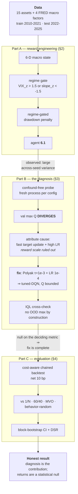

# Offline Reinforcement Learning for Goal-Based Portfolio Management

**Zhankai Zhang**  ·  MathWorks Summer Project (mentored by Yuchen Dong)  ·  MATLAB R2025b


An offline-RL study that extends the official MathWorks *Goal-Based Wealth Management*
(GBWM) demo to real market data, adds macro/regime/drawdown reward mechanisms, and then —
when the resulting agent proved unstable across seeds — **diagnoses and fixes an offline
value-function divergence**, cross-validated with a from-scratch IQL implementation.

---

## Results

All numbers below are on the **2022–2025 hold-out**, **net 10 bp** of drift-aware turnover
cost, over 30 non-overlapping 30-day windows. Sharpe is the primary metric; 95% CIs are
moving-block bootstrap (block = the 30-day horizon).

> **Two column scopes — read them separately.** *Chained Sharpe* and *Total ret* are computed
> on the **single chained wealth path** (the 30 windows joined end to end, so losses compound).
> *MaxDD P90*, *Term P10* and *Succ /30* are **per-window** statistics — wealth resets to
> 100,000 at the start of each 30-day window (`src/utils/windowMetrics.m:31-48`). So they
> describe *typical 30-day* risk, **not** the drawdown of the chained path: "+55.5% total
> return" and "18.6% MaxDD P90" are **not two properties of the same curve**. *Succ /30* counts
> windows ending at or above the goal, which is `goalWealth = 102000` against a 100,000 start —
> a **+2% hurdle over 30 days**.

### Performance vs baselines

Baselines: **behavior-random** (the uniform-random frontier policy that generated the offline
data — beating it is the canonical offline-RL success test), **1/N** equal-weight, **MVO**
(max-Sharpe tangency fit on train, not re-estimated on test), and **60/40** daily constant mix.

**C1 — the single shipped agent (seed 1000)**

| strategy | Chained Sharpe | 95% CI | DSR | Total ret | MaxDD P90 | Term P10 | Succ /30 |
|---|---|---|---|---|---|---|---|
| tuned-DQN (seed 1000) | 0.38 | [−0.56, 1.61] | 0.07 | **+55.5%** | 18.6% | 91567 | 15 |
| IQL (seed 1000) | 0.19 | [−0.66, 1.42] | 0.03 | +17.5% | 13.3% | 90931 | 12 |
| **1/N** | **0.62** | [−0.30, 1.71] | 0.15 | +37.4% | 10.3% | **95855** | 19 |
| 60/40 | 0.13 | [−0.93, 1.23] | 0.03 | +5.9% | **8.7%** | 95302 | 12 |
| MVO (train-fit tangency) | −0.32 | [−1.22, 0.90] | 0.00 | −14.0% | 9.3% | 93661 | 8 |
| behavior-random | −0.64 | [−1.56, 0.56] | 0.00 | −45.9% | 17.0% | 86345 | 11 |


**C2 — N = 10 seed ensemble (average Q, then argmax)**

| strategy | Chained Sharpe | 95% CI | DSR | Total ret | MaxDD P90 | Term P10 |
|---|---|---|---|---|---|---|
| tuned-DQN (N=10) | 0.12 | [−0.68, 1.37] | 0.02 | +12.4% | 15.4% | 91931 |
| IQL (N=10) | −0.31 | [−0.99, 0.90] | 0.00 | −24.8% | 16.0% | 92132 |
| **1/N** | **0.62** | [−0.30, 1.71] | 0.15 | +37.4% | 10.3% | **95855** |
| 60/40 | 0.13 | [−0.93, 1.23] | 0.03 | +5.9% | **8.7%** | 95302 |
| MVO (train-fit tangency) | −0.32 | [−1.22, 0.90] | 0.00 | −14.0% | 9.3% | 93661 |
| behavior-random | −0.64 | [−1.56, 0.56] | 0.00 | −45.9% | 17.0% | 86345 |


**How to read these tables**

- **The +55.5% is one seed, not an edge.** On the like-for-like metric — chained Sharpe, which
  prices return *and* risk on the same path — seed 1000 scores 0.38, *below* naïve 1/N's 0.62.
  It is less risk-efficient, not more. (Its per-window MaxDD P90 is also the worst in the
  table, 18.6% vs 1/N's 10.3% — a separate scope, but pointing the same way.) **Seed 1000 is
  the default first seed used a-priori throughout the project, and it also happens to be the
  strongest single path on this test set**, so it must not carry the argument.
- **The N=10 ensemble is the load-bearing number.** It removes single-seed luck: tuned-DQN
  ties 60/40 (0.12 vs 0.13) and still loses to 1/N. Its total return is also **sensitive to N**
  — an earlier sweep gave materially different, even negative, totals at N=5 and N=20 — so
  "+12.4%" is one pick, not a robust figure.
- **Every confidence interval includes zero.** On ~900 autocorrelated test days in a single
  regime, no strategy here is statistically separable from any other.
- **Nothing survives the multiple-testing haircut.** The highest DSR in either table is 0.15
  (1/N); every agent is at 0.07 or below. **This project makes no claim to beat a passive
  baseline** — see [Limitations](docs/REPORT.md#5-honest-limitations--conclusion).

> **Two caveats on both tables.** (1) *Cost:* these are a single **10 bp** operating point;
> the Week 8 cost sweep (0/5/10/20 bp) had already shown a nominal DQN edge at 0 bp
> evaporating by ~10 bp while 60/40 stays nearly cost-flat at a fraction of the turnover.
> (2) *Chaining:* the 29 window-boundary rebalances are **uncharged**, which favours the
> portfolio-switching agents over the static baselines — so the agents' true net numbers are,
> if anything, slightly worse than shown.

### The core finding — Q-value divergence, and the fix

The across-seed instability that had haunted every version since Week 3 was **not seed luck**.
A confound-free probe (one fresh MATLAB process per configuration) shows the validation
$\mathbb{E}[\max_a Q]$ **explodes with training**, reproducibly, on every seed:

| MaxEpochs | 100 | 200 | 400 |
|---|---|---|---|
| val mean max Q (seeds 1000/2000/3000) | 2.0 / 61 / 1.9 | 209 / 2018 / 2311 | 3307 / 27657 / 52298 |


- **The blow-up epoch is seed-dependent** — which is precisely why a fixed 100-epoch snapshot
  caught each seed at a different point on its divergence trajectory and looked like "seed
  noise". This is the textbook **deadly triad** (function approximation + bootstrapping +
  off-policy `max` over out-of-distribution actions).
- **Two misconfigured hyperparameters, not a broken algorithm.** Switching the target network
  from a hard copy every 4 steps to **Polyak averaging (τ = 1e-3)** and lowering the critic
  **LR 5e-4 → 1e-4** bounds Q to O(1) and collapses the across-seed spread.
- **Reward scale was ruled out** — shrinking the terminal bonus 1.0 → 0.05 did not remove the
  residual, so the sparse bonus is not the cause.


- **"Converges" carries one asterisk.** Both learners end bounded, but not identically:
  **IQL stays under the ~1.14 economic ceiling and flat across all epochs (0.24–0.96), while
  tuned-DQN reaches 1.86 by 400 epochs and is still mildly rising.** The marginal instability
  is suppressed, not eliminated — the ceiling is drawn on the figure below, and the DQN trace
  crosses it. That residual is exactly why the IQL cross-check is worth reporting rather than
  optional.
- **IQL confirms the fix structurally.** Implicit Q-Learning bootstraps from an in-sample
  expectile of $V$, so the exploding `max` over OOD actions never appears by construction
  (built from scratch, custom `dlfeval` loop). On the deciding diagnostic — across-seed
  eval-Sharpe over the epoch sweep — the two learners are **statistically indistinguishable**
  (n = 3, crossing, overlapping error bars). A structurally different learner reaching the
  same place on that metric is the confirmation that the fix is complete and the remaining
  ceiling is the data, not the algorithm. On the cost-aware chained evaluation above the two
  do diverge materially (0.12 vs −0.31) — a different protocol on a single realized path,
  which the confidence intervals already say cannot be resolved.


### What the agent actually learned

The policy is a deterministic `argmax_a Q(state)`, so it can be rendered directly as a map
over (wealth × time) at a fixed macro regime — each cell is the portfolio the N=10 ensemble
would hold there (blue = defensive, yellow = aggressive):


- **Wealth-conditioning is correct.** Above the goal line the agent turns defensive; when
  underfunded and late it turns aggressive — the *gamble-for-resurrection* behaviour GBWM
  theory predicts (Browne 1999; Das–Ostrov).
- **Regime-conditioning runs the wrong way**, and this is a **data limitation, not a smart
  bet.** The STRESS panel shifts aggressive (grid-mean action 4.8 → 9.3) because every stress
  episode in the training period — including COVID 2020 — was a V-shaped panic followed by
  recovery, so the reward taught "stress = buy the dip", a reflex that misfires in 2022's
  persistent grind.

## Workflow



---

## Requirements

**MATLAB R2025b** with the following toolboxes (all are used by the training/eval path):

| Toolbox | Used for | Key functions |
|---|---|---|
| Reinforcement Learning | offline training, agent & critic objects | `rlDQNAgent`, `rlVectorQValueFunction`, `trainFromData`, `rlTrainingFromDataOptions` |
| Financial | efficient-frontier action basis | `Portfolio`, `estimateFrontier`, `estimateFrontierByReturn` |
| Deep Learning | critic networks, custom IQL loop | `dlnetwork`, `dlfeval`, `adamupdate` |
| Statistics and Machine Learning | percentile metrics, DSR moments | `prctile`, `skewness`, `kurtosis`, `normcdf` |

Check your installation with `ver`, or run the bundled self-check:

```bash
matlab -batch "addpath('src'); checkRequirements"
```

**Python 3.9+** is needed only to fetch the data (not to train or evaluate):

```bash
pip install -r scripts/requirements.txt      # yfinance · pandas · fredapi · numpy
export FRED_API_KEY=<your key>               # free: https://fred.stlouisfed.org/docs/api/api_key.html
```

**Quick start** (full recipe in [§6 Reproduction](docs/REPORT.md#6-reproduction)):

```bash
python scripts/fetch_data.py && python scripts/merge_train_val.py   # 1. get data
matlab -batch "addpath('src'); addpath('src/utils'); eval_compare"  # 2. reproduce all tables
bash scripts/check_final_agent.sh                                   # 3. cold-load shipped agent
```

---

## Full report

The complete write-up — problem framing, data, the reward derivations, the full divergence
investigation with its mechanism and attribution, evaluation methodology, limitations, and
references — is in **[`docs/REPORT.md`](docs/REPORT.md)**.

| section | what it covers |
|---|---|
| [§1 Background & concepts](docs/REPORT.md#1-background--concepts) | the GBWM objective; why an underfunded portfolio rationally takes *more* risk; how the 15-action frontier is built |
| [§1.5 Data & experimental setup](docs/REPORT.md#15-data--experimental-setup) | the 15 assets, 4 FRED macro factors, train/test splits, and the evaluation protocol |
| [§2 Reward engineering (Part A)](docs/REPORT.md#2-reward-engineering--and-the-model-evolution-part-a) | macro state, regime gate, the drawdown penalty, the abandoned λ-loss variant, and the stage-by-stage evolution table |
| [§3 Divergence investigation (Part B)](docs/REPORT.md#3-the-divergence-investigation-part-b--the-headline) | the deadly-triad mechanism, how the cause was attributed, the fix, and the IQL cross-check |
| [§4 Evaluation (Part C)](docs/REPORT.md#4-evaluation-part-c-single-seed-then-ensemble) | the Deflated Sharpe Ratio, block bootstrap, baseline definitions, and caveats |
| [§5 Limitations & conclusion](docs/REPORT.md#5-honest-limitations--conclusion) | statistical power, and what actually transfers from this work |
| [§6 Reproduction](docs/REPORT.md#6-reproduction) | the full regenerate-from-scratch recipe and repository layout |
| [§7 References](docs/REPORT.md#7-references) | all cited literature |

---

## License & citation

Code and figures are released under the **MIT License** (see [`LICENSE`](LICENSE)). To reference this work:

```bibtex
@misc{zhang2026gbwmofflinerl,
  author = {Zhang, Zhankai},
  title  = {Offline Reinforcement Learning for Goal-Based Portfolio Management},
  year   = {2026},
  note   = {MathWorks Summer Project (mentored by Yuchen Dong)},
  howpublished = {\url{https://github.com/zzkai098/mathworks-offline-rl}}
}
```

---

*Author: **Zhankai Zhang** · Mentored by Yuchen Dong (MathWorks). Reproducible per
[§6 Reproduction](docs/REPORT.md#6-reproduction); all reported metrics are persisted in
[`docs/eval_results.txt`](docs/eval_results.txt).*
