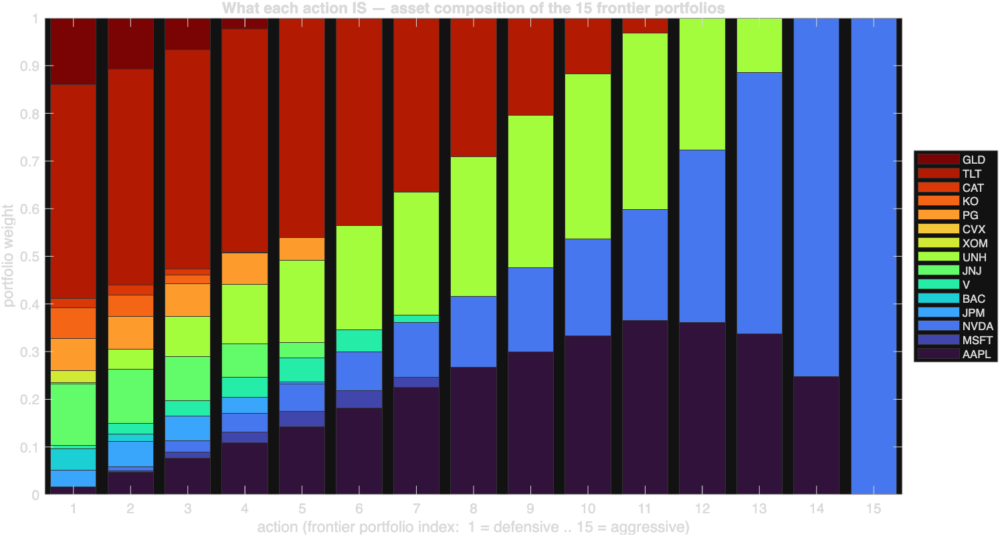
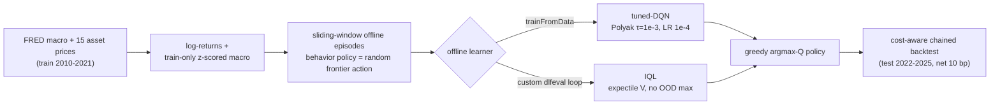
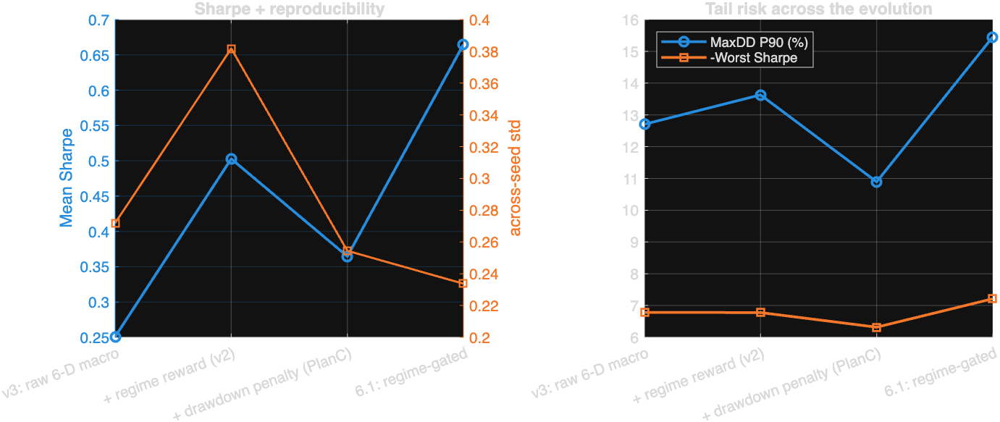
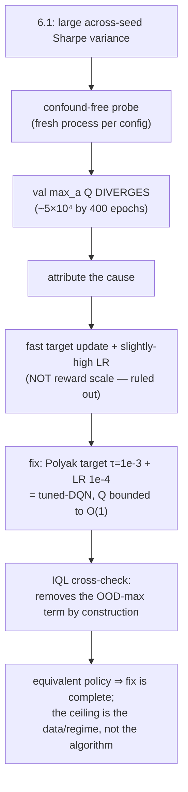
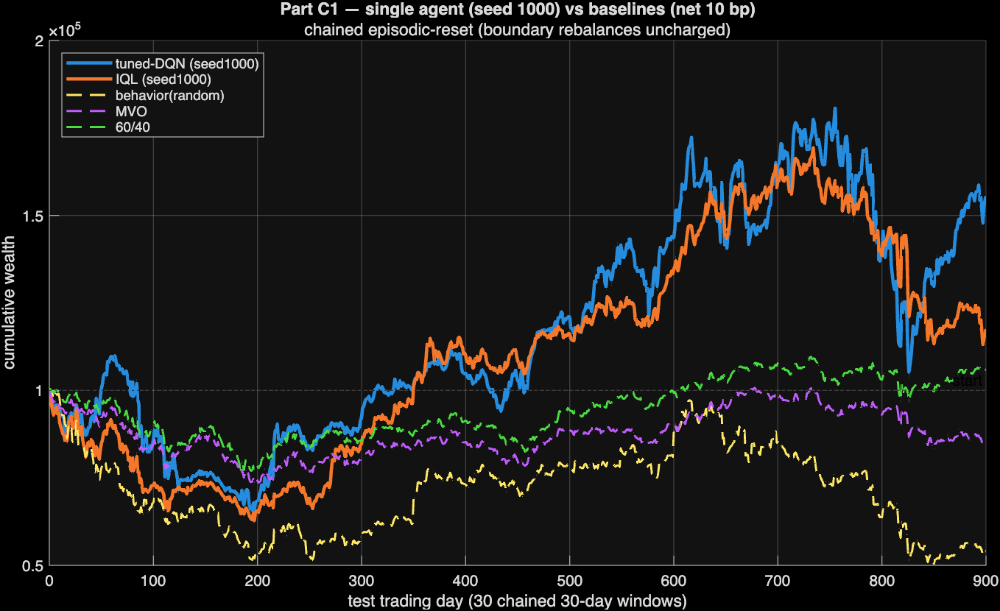
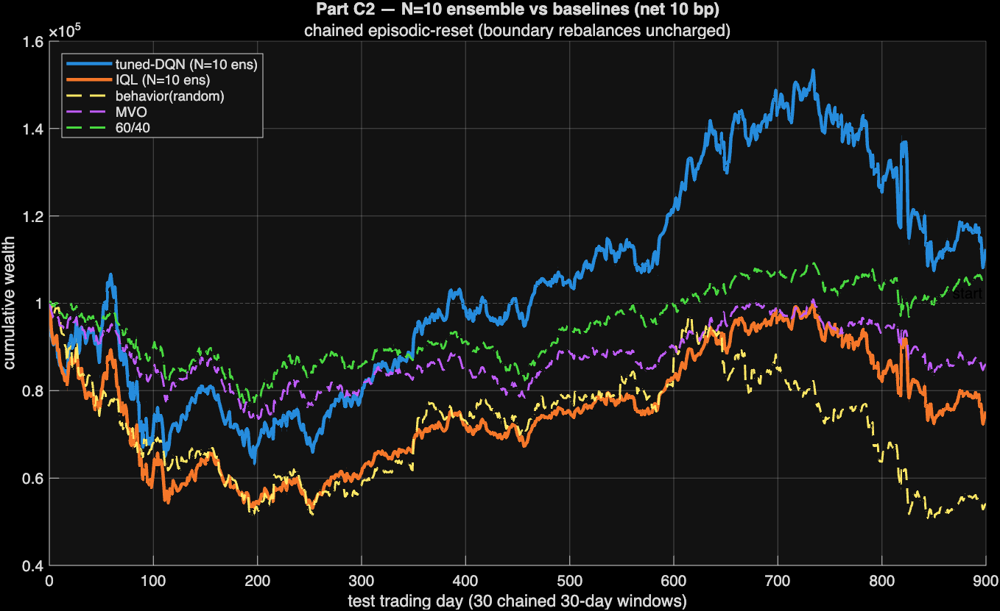
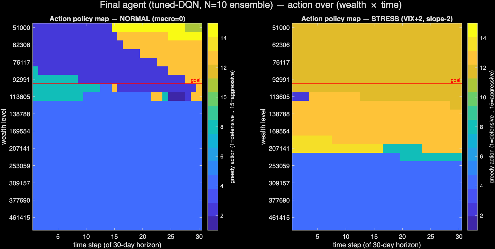

# Offline Reinforcement Learning for Goal-Based Portfolio Management

**Zhankai Zhang**  ·  MathWorks Summer Project (mentored by Yuchen Dong)  ·  MATLAB R2025b


An offline-RL study that extends the official MathWorks *Goal-Based Wealth Management*
(GBWM) demo to real market data, adds macro/regime/drawdown reward mechanisms, and then —
when the resulting agent proved unstable across seeds — **diagnoses and fixes an offline
value-function divergence**, cross-validated with a from-scratch IQL implementation.

---

## Table of contents
1. [Background & concepts](#1-background--concepts)
2. [Data & experimental setup](#15-data--experimental-setup)
3. [Reward engineering — and the model evolution (Part A)](#2-reward-engineering--and-the-model-evolution-part-a)
4. [The divergence investigation (Part B) — the headline](#3-the-divergence-investigation-part-b--the-headline)
5. [Evaluation (Part C): single-seed, then ensemble](#4-evaluation-part-c-single-seed-then-ensemble)
6. [Honest limitations & conclusion](#5-honest-limitations--conclusion)
7. [Reproduction](#6-reproduction)
8. [References](#7-references)

---

## 1. Background & concepts

**Goal-Based Wealth Management (GBWM)** reframes "risk" as *the probability of not reaching a
goal* rather than return volatility. The objective is

$$\max_{A(0),\dots,A(T-1)}\; P\big(W(T) \ge G\big)$$

where `W(T)` is terminal wealth, `G` the goal, and `A(t)` the portfolio chosen each period.
This produces a famous paradox: when a portfolio is **underfunded**, *increasing* volatility
can be optimal because it raises the chance of reaching `G` — the opposite of conventional
risk aversion (Browne 1999; Das, Ostrov et al. 2018). This project builds directly on the
MathWorks GBWM-RL example (see References) and its problem framing.

**As a reinforcement-learning problem** (following the demo):

| Component | Definition |
|---|---|
| **State** | `[normalized wealth, time]` in the demo; extended here to 6-D by appending 4 z-scored macro factors |
| **Action** | one of **15 discrete efficient-frontier portfolios** (each a full weight vector, not a single asset) |
| **Reward** | sparse terminal bonus for reaching the goal, plus the shaping terms introduced below |
| **Agent** | Deep Q-Network (discrete actions, continuous state); here also IQL |

The **efficient frontier** (Markowitz 1952) is discretized into 15 portfolios once, from the
training window's return moments. Discretization buys (i) tractability — no continuous action
optimization during training, (ii) automatic constraint satisfaction (fully invested, long-
only, ≤50% per asset), and (iii) a time-homogeneous action set. **Each action is a diversified
mix**, sliding from defensive (bond/gold-heavy) to aggressive (equity-heavy):



*Action 1 ≈ TLT 45% + GLD + defensive equity; action 15 ≈ 100% NVDA. Only the extreme
aggressive corner degenerates to a single asset — every other action is a portfolio.*

**Pipeline (offline RL).** Training never interacts with a live environment; it learns from a
fixed dataset of logged transitions generated by a random *behavior policy*:



---

## 1.5 Data & experimental setup

| Item | Value |
|---|---|
| **Assets (15)** | AAPL, MSFT, NVDA, JPM, BAC, V, JNJ, UNH, XOM, CVX, PG, KO, CAT (13 equities) + **TLT** (long bond) + **GLD** (gold) |
| **Macro factors (4, FRED)** | DGS10 (10-yr yield), T10Y2Y (yield-curve slope), VIXCLS (VIX), DFF (fed funds) |
| **Train (shipped agents, 6.1)** | 2010-01-04 → 2021-12-31 (`prices_train_extended.csv`, includes the COVID crash) |
| **Train (early evolution v3/v5)** | 2010-01-04 → 2019-12-31 (`prices_train.csv`) |
| **Test (all reported results)** | 2022-01-03 → 2025-12-31 (~1000 available days; 900 evaluated as 30×30-day windows) |
| **Normalization** | macro z-scored on **train only**, applied unchanged to test (no look-ahead) |
| **Rebalancing** | daily; turnover is drift-aware (held weights drift with realized returns before the next trade) |
| **Eval protocol** | 30 non-overlapping 30-day windows chained end-to-end into one wealth path (the agent's *observed* wealth/time resets to the window start each 30 days; backtest wealth compounds across windows) |

The 2022–2025 test window is deliberately **out of the training distribution** (2022 stock-bond
co-drawdown, then the 2023–2025 AI rally) — a hard regime the training period has no true
analogue for. Data CSVs are regenerated from source (see [Reproduction](#6-reproduction)); they
are not committed.

---

## 2. Reward engineering — and the model evolution (Part A)

The demo uses a 2-D state and a sparse reward. This project layered on three mechanisms, each
motivated by the literature **before** it was tried:

1. **Macro state (6-D).** Risk-neutral, macro-blind RL cannot see regime; regime-aware RL adds
   latent macro signals to condition allocation (Adaptive & Regime-Aware RL, Raj 2025 — *further
   reading*). We append 4 z-scored FRED factors.
2. **Regime gate.** A binary stress flag `VIX_z > 1.5 OR T10Y2Y_z < −1.5` marks crisis days, so
   shaping can be applied *conditionally* rather than globally.
3. **Regime-gated drawdown penalty** `r_t = log(W'/W) − β·max(0, DD_t − 3%) + terminal bonus`,
   with **β = 8 in stress, 2 otherwise**. Encoding drawdown/CVaR directly in the reward is the
   standard risk-sensitive-RL recipe (Moody & Saffell 2001 for RL-for-trading reward design;
   risk-sensitive DRL and CVaR-reward work — *further reading*). An earlier attempt used a
   **λ-loss amplification** on stress days (Kahneman–Tversky 1979 loss aversion, λ≈2.5); it
   **saturated and was abandoned** because a loss multiplier is action-independent, so it could
   not teach *which* action to prefer in a regime. The drawdown penalty is action-dependent by
   construction, which is why it worked where λ-loss did not.

**Formally**, with a per-day stress flag $s_t$, running drawdown $\mathrm{DD}_t$, goal $G$, and
terminal bonus $b$, the shipped **6.1** reward is

$$s_t=\mathbb{1}\!\left[\mathrm{VIX}_z(t)>1.5\ \lor\ \mathrm{T10Y2Y}_z(t)<-1.5\right],\qquad \beta(s_t)=\begin{cases}8 & s_t=1\\ 2 & s_t=0\end{cases}$$

$$r_t=\log\frac{W_{t+1}}{W_t}\;-\;\beta(s_t)\,\max\!\left(0,\ \mathrm{DD}_t-0.03\right)\;+\;b\,\mathbb{1}[t=T]\,\mathbb{1}[W_T\ge G],\qquad \mathrm{DD}_t=\frac{\max_{k\le t}W_k-W_t}{\max_{k\le t}W_k}$$

The **abandoned** v2 variant amplified only stress-day losses — action-independent, hence it saturated:

$$r_t^{\text{v2}}=\begin{cases}\lambda\,\log(W_{t+1}/W_t) & s_t=1\ \text{and}\ \log(W_{t+1}/W_t)<0\\ \log(W_{t+1}/W_t) & \text{otherwise}\end{cases}\qquad(\lambda\approx2.5)$$

**Part A — the 6-D DQN evolution.** Each stage's 5 saved agents are re-loaded and replayed
greedily through the test windows (each with its own train-window frontier + normalizer):

| stage | Success /30 | Mean Sharpe | Across-seed std | Mean MaxDD | MaxDD P90 | Worst Sharpe | Term P10 |
|---|---|---|---|---|---|---|---|
| v3: raw 6-D macro | 11.6 | 0.25 | 0.27 | 6.2% | 12.7% | −6.78 | 91278 |
| + regime reward (v2, λ-loss, *abandoned*) | 13.0 | 0.50 | 0.38 | 7.7% | 13.6% | −6.78 | 91259 |
| + drawdown penalty (Plan C) | 10.6 | 0.36 | 0.25 | 5.8% | 10.9% | −6.32 | 93662 |
| **6.1: regime-gated drawdown** | **14.6** | **0.66** | **0.23** | 7.8% | 15.5% | −7.21 | 89338 |



> **Protocol note (read before comparing to Part C).** Part A numbers are **gross (cost = 0),
> per-window Sharpe** (each 30-day window resets wealth — this *flatters* Sharpe), averaged over
> 5 seeds, and stop at **6.1 (pre-fix)**. Part C uses **net-of-cost, chained** Sharpe on the
> *shipped, fixed* agent. The two are different measurements — **do not** read 6.1's 0.66 here
> against the tuned-DQN's 0.38 there and conclude the fix "hurt returns" — you cannot conclude that from these numbers.

6.1 has the best mean Sharpe and the tightest across-seed spread — yet across-seed variance had
haunted every version since Week 3. **Why?** That question is the real result.

---

## 3. The divergence investigation (Part B) — the headline

The across-seed instability was **not seed luck** — it was **Q-value divergence**. A confound-
free probe (one **fresh MATLAB process per configuration**, because `trainFromData` carries
internal RNG/datastore state that `rng(seed)` does not reset) shows the validation
`mean(max_a Q)` **explodes with training** — all seeds, reproducibly (≈2/61/2 at 100 epochs →
≈3.3k/28k/52k at 400):


This is the textbook **deadly triad** — function approximation + bootstrapping + off-policy /
out-of-distribution `max` (Sutton & Barto 2018; van Hasselt et al. 2018; overestimation:
van Hasselt et al. 2016). The blow-up epoch is *seed-dependent*, which is exactly why a fixed
100-epoch snapshot caught each seed at a different point on its divergence trajectory.

Concretely, the target the DQN critic regresses onto is

$$y=r+\gamma\,\underbrace{\max_{a'}Q_{\bar\theta}(s',a')}_{\text{evaluated at out-of-distribution }a'}$$

and offline those $a'$ never appear in the dataset, so the $\max$ latches onto over-estimated
Q-values that feed back through the recursion — the blow-up above.

**Decomposition (each step gated by an independent review):**



- **Target-update speed is the dominant driver.** 6.1 hard-copied the target net every 4 steps.
  Switching to **Polyak soft-averaging (τ = 1e-3)** bounds Q and collapses the across-seed
  spread; lowering the critic **LR 5e-4 → 1e-4** removes a residual at 400 epochs.
- **Reward scale is *not* the cause** — shrinking the terminal bonus 1.0 → 0.05 did not fix the
  residual (ruling out the sparse-bonus scale).


**IQL as the principled cross-check.** Implicit Q-Learning (Kostrikov et al. 2022) learns an
**expectile of V** from *in-dataset* actions and bootstraps Q from `V(s')` — so the exploding
`max_a Q(s', a_OOD)` term **never appears**. Built from scratch (a custom `dlfeval` loop, since
`trainFromData` has no IQL). Both learners end **bounded and reproducible**; a structurally
different method reaching an **equivalent policy** confirms the fix is complete and the ceiling
is the data/regime, not the algorithm. (See also the offline-RL pessimism literature: Levine et
al. 2020; Kumar et al. 2020, CQL.) It replaces that $\max$ with an **in-sample expectile** of
$V$ (level $\tau=0.7$) and a plain TD backup — **no `max` over OOD actions anywhere**:

$$L_V=\mathbb{E}_{(s,a)\sim\mathcal{D}}\big[\,|\tau-\mathbb{1}(u<0)|\;u^2\,\big],\quad u=Q_{\bar\theta}(s,a)-V_\psi(s)$$

$$L_Q=\mathbb{E}_{(s,a,s')\sim\mathcal{D}}\big[\,\big(r+\gamma\,V_\psi(s')-Q_\theta(s,a)\big)^2\,\big]$$


**Net:** 6.1's instability was two misconfigured hyperparameters (fast target + slightly-high
LR). A properly-configured vanilla DQN (Polyak τ=1e-3 + LR 1e-4) **converges**; IQL reaches the
same place by construction.

---

## 4. Evaluation (Part C): single-seed, then ensemble

Cost-aware backtest on the 2022–2025 test path, **net 10 bp**, with a **moving-block bootstrap**
95% Sharpe CI (block = 30-day horizon; Künsch 1989) and the **Deflated Sharpe Ratio** (DSR;
Bailey & López de Prado 2014, trial count set to the honest ~40 configs tried across the
project):

$$\mathrm{DSR}=\Phi\!\left(\frac{(\widehat{SR}-SR_0)\sqrt{T-1}}{\sqrt{1-\gamma_3\widehat{SR}+\tfrac{\gamma_4-1}{4}\widehat{SR}^2}}\right)$$

where $\gamma_3,\gamma_4$ are the return skew/kurtosis and $SR_0$ is the Sharpe one would
expect as the maximum across the $N$ trials under the null — so a high nominal Sharpe is
discounted for both non-normality and multiple testing. Chained Sharpe (no per-window reset)
is the primary, honest metric; total return is
secondary because it hides path risk.

**Baselines.** *behavior-random* (the uniform-random frontier policy that generated the offline
data — beating it is the canonical offline-RL success test); **1/N** equal-weight (DeMiguel,
Garlappi & Uppal 2009, "hard to beat"); **MVO** = max-Sharpe tangency **fit on train, not
re-estimated on test**; **60/40** daily constant mix.

### C1 — single shipped agent (seed 1000)

| strategy | **Chained Sharpe** | 95% CI | DSR | Total ret | MaxDD P90 | Term P10 | Succ /30 |
|---|---|---|---|---|---|---|---|
| tuned-DQN (seed 1000) | 0.38 | **[−0.56, 1.61]** | 0.07 | +55.5% | 18.6% | 91567 | 15 |
| IQL (seed 1000) | 0.19 | **[−0.66, 1.42]** | 0.03 | +17.5% | 13.3% | 90931 | 12 |
| **1/N** | **0.62** | [−0.30, 1.71] | 0.15 | +37.4% | 10.3% | **95855** | 19 |
| 60/40 | 0.13 | [−0.93, 1.23] | 0.03 | +5.9% | **8.7%** | 95302 | 12 |
| MVO (train-fit tangency) | −0.32 | [−1.22, 0.90] | 0.00 | −14.0% | 9.3% | 93661 | 8 |
| behavior-random | −0.64 | [−1.56, 0.56] | 0.00 | −45.9% | 17.0% | 86345 | 11 |



**Read it correctly.** The tuned-DQN's headline **+55.5% total return is *not* an edge**: its
**chained Sharpe (0.38) is below naïve 1/N (0.62)** — the extra return was bought with enough
extra volatility and drawdown (MaxDD P90 18.6% vs 1/N's 10.3%) that it is *less* risk-efficient.
Its CI includes 0; its DSR (0.07) survives no multiple-testing haircut. **Seed 1000 is the
default first seed used a-priori throughout the project, and it also happens to be the strongest
single path on this test set** — so it must not carry the argument. The load-bearing comparison
is the unbiased ensemble below.

### C2 — N = 10 seed ensemble (average Q, then argmax)

| strategy | **Chained Sharpe** | 95% CI | DSR | Total ret | MaxDD P90 | Term P10 |
|---|---|---|---|---|---|---|
| tuned-DQN (N=10) | 0.12 | [−0.68, 1.37] | 0.02 | +12.4% | 15.4% | 91931 |
| IQL (N=10) | −0.31 | [−0.99, 0.90] | 0.00 | −24.8% | 16.0% | 92132 |
| **1/N** | **0.62** | [−0.30, 1.71] | 0.15 | +37.4% | 10.3% | **95855** |
| 60/40 | 0.13 | [−0.93, 1.23] | 0.03 | +5.9% | **8.7%** | 95302 |
| MVO (train-fit tangency) | −0.32 | [−1.22, 0.90] | 0.00 | −14.0% | 9.3% | 93661 |
| behavior-random | −0.64 | [−1.56, 0.56] | 0.00 | −45.9% | 17.0% | 86345 |



The ensemble removes the single-seed luck: **tuned-DQN ties 60/40 (0.12 vs 0.13) and loses to
1/N**; IQL's ensemble is negative on this path. The ensemble's total return is also **sensitive
to N** (an earlier sweep gave materially different, even negative, totals at N=5 and N=20), so
"+12.4%" is one pick, not a robust number.

> **Two caveats that apply to both tables.** (1) *Cost:* results are at a single **10 bp**
> operating point; the Week 8 cost-sweep harness (`src/archive/week8_backtest_harness.m`, 0/5/10/20 bp) had
> already established the pattern — a nominal DQN edge at 0 bp evaporates by ~10 bp while 60/40
> is nearly cost-flat at a fraction of the turnover. (`windowMetrics` also tracks per-strategy
> turnover if a fuller table is wanted.) (2) *Chaining:* the 29 window-boundary rebalances are
> **uncharged**, which favors the portfolio-switching agents over the static baselines — i.e.
> the agents' true net numbers are, if anything, slightly worse than shown.

### What the agent actually learned

Because the policy is a deterministic `argmax_a Q(state)`, we can render it as a map over
(wealth × time) at a fixed macro regime. Each cell = the single portfolio the N=10 ensemble
would hold there (blue = defensive, yellow = aggressive):



Two readable structures: (1) **above the goal line → defensive; underfunded & late → aggressive**
— the legitimate *gamble-for-resurrection* that GBWM theory predicts (Browne 1999; Das–Ostrov),
i.e. correct **wealth**-conditioning. (2) The **STRESS panel shifts aggressive** (grid-mean
action 4.8 → 9.3). This **counter-intuitive regime direction is a data limitation, not a smart
bet**: every stress episode in the training period (incl. COVID 2020) was a V-shaped panic
*followed by recovery*, so the reward taught "stress = buy the dip" — a reflex that misfires in
2022's persistent grind. Separating the two drivers (wealth vs regime) keeps the story honest:
the wealth-conditioning is correct; the regime-conditioning reflects what the data contained.

---

## 5. Honest limitations & conclusion

- **Statistical power.** One 2022–2025 regime (≈900 chained days of ~1000 available, autocorrelated) ⇒ the Sharpe standard
  error is far too large to resolve the ~0.1 differences at stake. Every CI here includes 0.
  This is a *sample* limitation — no algorithm beats it on this data, which is precisely why the
  headline is the diagnosis, not the returns.
- **What transfers** is method-level: a bounded, reproducible offline learner reached
  independently by (a) a correctly-configured DQN (Polyak + LR) and (b) a structurally
  pessimistic IQL — the equivalence is the confirmation.
- **Excluded** from this deliverable: a separate simulation-based P(goal)/dynamic-programming
  study (`archive/gbwm_pgoal/`), kept out to keep this report strictly real-data.

**Conclusion.** This project's value is the offline-RL *engineering diagnosis*: identifying that
"seed noise" was value divergence, attributing it to two hyperparameters, fixing it, and
cross-validating with IQL — reported alongside fully honest performance nulls.

---

## 6. Reproduction

**Environment:** MATLAB **R2025b** with Reinforcement Learning, Financial, Statistics & Machine
Learning, Deep Learning, and Optimization toolboxes. Run from the repo root.

**A fresh clone contains no data, models, or logs** — the `.gitignore` excludes `*.mat` (model
files), `*.log`, `experiments/logs/*`, and `data/{prices,macro,dataset}_*.csv`. Everything is regenerate-only, in
order:

```bash
# 1. data (FRED + prices) and the extended train split
python scripts/fetch_data.py
python scripts/merge_train_val.py

# 2. diagnosis figures (Part B) — fresh process per config
bash scripts/run_week9c.sh   && matlab -batch "addpath('src'); week9c_plot"
bash scripts/run_week9d.sh   && matlab -batch "addpath('src'); week9d_plot"
bash scripts/run_matrix.sh   && matlab -batch "addpath('src'); week10_matrix_plot"

# 3. train the deliverable agents (Part C weights)
bash scripts/train_dqn_seeds.sh          # -> experiments/models/dqn_seed_*.mat
bash scripts/train_iql_seeds.sh          # -> experiments/models/iql_seed_*.mat
matlab -batch "addpath('src'); train_final_agent"   # -> FinalAgent.mat (seed 1000)

# 4. the whole report evaluation (Parts A/B/C, all tables + figures)
matlab -batch "addpath('src'); addpath('src/utils'); eval_compare"

# acceptance: cold-load the shipped agent and run inference
bash scripts/check_final_agent.sh
```

**Using the shipped agent** (clean session):

```matlab
S = load('experiments/models/FinalAgent.mat');          % struct FA — tuned-DQN, seed 1000
% inputs: current wealth, step t in 1..30, raw macro [DGS10 T10Y2Y VIXCLS DFF]
[actionIdx, weights] = predictAction(S.FA, 101000, 5, [4.2 -0.5 18 5.3]);
% actionIdx -> one of the 15 frontier portfolios; weights -> 15-asset allocation (sums to 1)
```

The numbers in this README are persisted verbatim in [`docs/eval_results.txt`](docs/eval_results.txt).

**Repository layout**

```
src/                current MATLAB code
  eval_compare.m      the report evaluation (Parts A/B/C)
  train_final_agent.m / predictAction.m / predictActionIQL.m   train + inference
  week9c/9d/9f_*      divergence diagnosis
  week10_iql_session.m / week10_matrix_plot.m / week10_backtest.m
  week10_action_policymap.m / week10_action_weights.m
  week6_1_regime_gated.m   the pre-fix 6.1 baseline
  utils/              buildEvalBasis · replayPolicy · windowMetrics ·
                      blockBootstrapSharpeCI · deflatedSharpe · inputTestData
  archive/            historical week2-8 / cql experiments
scripts/            shell/python runners (fetch_data, run_week9*, train_*_seeds, ...)
experiments/
  models/  figures/  logs/(+archive/)     weights / plots / run logs  (gitignored)
docs/               weekly_reports/ · eval_results.txt
archive/gbwm_pgoal/ excluded simulation-based P(goal) study
```

**Deliverable figures** (all in `experiments/figures/`): `action_weight_composition`,
`eval_partA_evolution`, `week9c_divergence`, `week9d_ab_slowtarget`, `week10_dqn_vs_iql`,
`eval_partC1_single_equity`, `eval_partC2_ensemble_equity`, `final_agent_action_policymap`.
(`week8_net_sharpe`, `week10_equity_curves/ensemble/n10`, and the single-seed action timeline
are intentionally superseded by the `eval_part*` figures.)

---

## 7. References

**Goal-based wealth management & portfolio theory**
- MathWorks. *Multi-Period Goal-Based Wealth Management Using Reinforcement Learning.* MATLAB
  documentation example. https://www.mathworks.com/help/finance/multi-period-goal-based-wealth-management-using-reinforcement-learning.html
- Markowitz, H. (1952). Portfolio Selection. *Journal of Finance* 7(1): 77–91.
- Browne, S. (1999). Reaching goals by a deadline: digital options and continuous-time active
  portfolio management. *Advances in Applied Probability* 31(2): 551–577.
- Das, S. R., Ostrov, D., Radhakrishnan, A., & Srivastav, D. (2018). Goals-Based Wealth
  Management: A New Approach. *Journal of Investment Management*; and *Dynamic portfolio
  allocation in goals-based wealth management*, *Computational Management Science* (2019).

**Reinforcement learning & offline RL**
- Sutton, R. S., & Barto, A. G. (2018). *Reinforcement Learning: An Introduction* (2nd ed.). MIT Press.
- Mnih, V., et al. (2015). Human-level control through deep reinforcement learning. *Nature* 518: 529–533.
- van Hasselt, H., Guez, A., & Silver, D. (2016). Deep Reinforcement Learning with Double
  Q-learning. *AAAI*.
- van Hasselt, H., Doron, Y., Strub, F., Hessel, M., Sonnerat, N., & Modayil, J. (2018). Deep
  Reinforcement Learning and the Deadly Triad. *arXiv:1812.02648*.
- Levine, S., Kumar, A., Tucker, G., & Fu, J. (2020). Offline Reinforcement Learning: Tutorial,
  Review, and Perspectives on Open Problems. *arXiv:2005.01643*.
- Kumar, A., Zhou, A., Tucker, G., & Levine, S. (2020). Conservative Q-Learning for Offline
  Reinforcement Learning. *NeurIPS*.
- Kostrikov, I., Nair, A., & Levine, S. (2022). Offline Reinforcement Learning with Implicit
  Q-Learning. *ICLR 2022*.

**Reward design, evaluation & statistics**
- Moody, J., & Saffell, M. (2001). Learning to trade via direct reinforcement. *IEEE Transactions
  on Neural Networks* 12(4): 875–889. (See also Moody, Wu, Liao & Saffell, 1998, *J. Forecasting*.)
- Kahneman, D., & Tversky, A. (1979). Prospect Theory: An Analysis of Decision under Risk.
  *Econometrica* 47(2): 263–291.
- DeMiguel, V., Garlappi, L., & Uppal, R. (2009). Optimal Versus Naive Diversification: How
  Inefficient Is the 1/N Portfolio Strategy? *Review of Financial Studies* 22(5): 1915–1953.
- Bailey, D. H., & López de Prado, M. (2014). The Deflated Sharpe Ratio: Correcting for Selection
  Bias, Backtest Overfitting, and Non-Normality. *Journal of Portfolio Management* 40(5): 94–107.
- Künsch, H. R. (1989). The Jackknife and the Bootstrap for General Stationary Observations.
  *Annals of Statistics* 17(3): 1217–1241.

**Further reading (motivating context, non-load-bearing)**
- Wang, X., & Liu, L. (2025). Risk-Sensitive Deep Reinforcement Learning for Portfolio
  Optimization. *JRFM* 18(7): 347.
- Raj, G. N. (2025). Adaptive and Regime-Aware RL for Portfolio Optimization. *arXiv:2509.14385*.
- Chen, et al. (2026). Behaviorally informed deep reinforcement learning for portfolio
  optimization with loss aversion and overconfidence. *Scientific Reports*.
- Ni, X., Liu, G., & Lai, L. (2024). Risk-Sensitive Reward-Free Reinforcement Learning with CVaR.
  *ICML 2024*.

---

## License & citation

Code and figures are released under the **MIT License** (see [`LICENSE`](LICENSE)). To reference this work:

```bibtex
@misc{zhang2026gbwmofflinerl,
  author = {Zhang, Zhankai},
  title  = {Offline Reinforcement Learning for Goal-Based Portfolio Management},
  year   = {2026},
  note   = {MathWorks Summer Project (mentored by Yuchen Dong)},
  howpublished = {\url{https://github.com/zzkai098/mathworks-offline-rl}}
}
```

---

*Author: **Zhankai Zhang** · Mentored by Yuchen Dong (MathWorks). Reproducible per §6; all
reported metrics are persisted in [`docs/eval_results.txt`](docs/eval_results.txt).*
