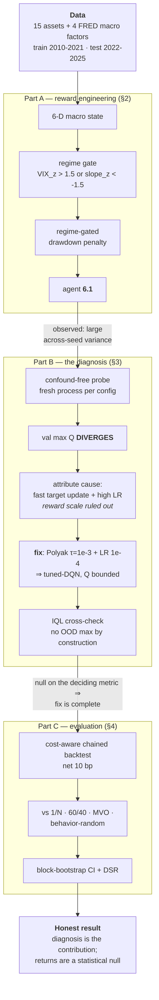

# Offline Reinforcement Learning for Goal-Based Portfolio Management

**Zhankai Zhang**  ·  MathWorks Summer Project (mentored by Yuchen Dong)  ·  MATLAB R2025b


An offline-RL study that extends the official MathWorks *Goal-Based Wealth Management*
(GBWM) demo to real market data, adds macro/regime/drawdown reward mechanisms, and then —
when the resulting agent proved unstable across seeds — **diagnoses and fixes an offline
value-function divergence**, cross-validated with a from-scratch IQL implementation.

---

## Results

All numbers below are on the **2022–2025 hold-out**, **net 10 bp** of drift-aware turnover
cost, over 30 non-overlapping 30-day windows. Sharpe is the primary metric; 95% CIs are
moving-block bootstrap (block = the 30-day horizon).

### Performance vs baselines

Baselines: **behavior-random** (the uniform-random frontier policy that generated the offline
data — beating it is the canonical offline-RL success test), **1/N** equal-weight, **MVO**
(max-Sharpe tangency fit on train, not re-estimated on test), and **60/40** daily constant mix.

**C1 — the single shipped agent (seed 1000)**

| strategy | Chained Sharpe | 95% CI | DSR | Total ret | MaxDD P90 | Term P10 | Succ /30 |
|---|---|---|---|---|---|---|---|
| tuned-DQN (seed 1000) | 0.38 | [−0.56, 1.61] | 0.07 | **+55.5%** | 18.6% | 91567 | 15 |
| IQL (seed 1000) | 0.19 | [−0.66, 1.42] | 0.03 | +17.5% | 13.3% | 90931 | 12 |
| **1/N** | **0.62** | [−0.30, 1.71] | 0.15 | +37.4% | 10.3% | **95855** | 19 |
| 60/40 | 0.13 | [−0.93, 1.23] | 0.03 | +5.9% | **8.7%** | 95302 | 12 |
| MVO (train-fit tangency) | −0.32 | [−1.22, 0.90] | 0.00 | −14.0% | 9.3% | 93661 | 8 |
| behavior-random | −0.64 | [−1.56, 0.56] | 0.00 | −45.9% | 17.0% | 86345 | 11 |


**C2 — N = 10 seed ensemble (average Q, then argmax)**

| strategy | Chained Sharpe | 95% CI | DSR | Total ret | MaxDD P90 | Term P10 |
|---|---|---|---|---|---|---|
| tuned-DQN (N=10) | 0.12 | [−0.68, 1.37] | 0.02 | +12.4% | 15.4% | 91931 |
| IQL (N=10) | −0.31 | [−0.99, 0.90] | 0.00 | −24.8% | 16.0% | 92132 |
| **1/N** | **0.62** | [−0.30, 1.71] | 0.15 | +37.4% | 10.3% | **95855** |
| 60/40 | 0.13 | [−0.93, 1.23] | 0.03 | +5.9% | **8.7%** | 95302 |
| MVO (train-fit tangency) | −0.32 | [−1.22, 0.90] | 0.00 | −14.0% | 9.3% | 93661 |
| behavior-random | −0.64 | [−1.56, 0.56] | 0.00 | −45.9% | 17.0% | 86345 |


*Chained Sharpe and Total ret are on the chained path; MaxDD P90, Term P10 and Succ /30 are
per-window (wealth resets each window, goal = +2%).*

**How to read these tables**

- **Offline learning did work.** Every configuration beats **behavior-random** — the policy
  that generated its own training data — by +0.33 to +1.02 Sharpe. That is the canonical
  offline-RL success test, and all four agents pass it.
- **It did not beat the naive baselines.** +55.5% is not an edge: that seed's Sharpe (0.38) is
  below 1/N's (0.62). The N=10 ensemble ties 60/40 and loses to 1/N.
- **Every CI includes zero** — including the margin over behavior-random. ~900 autocorrelated
  days in one regime separates nothing.
- **Nothing survives the multiple-testing haircut** — DSR peaks at 0.15 (1/N); every agent is
  ≤ 0.07. **No claim is made to beat a passive baseline**
  ([Limitations](docs/REPORT.md#5-honest-limitations--conclusion)).

### The core finding — Q-value divergence, and the fix

The across-seed instability that had haunted every version since Week 3 was **not seed luck** —
the validation $\mathbb{E}[\max_a Q]$ **diverges**, reproducibly, on every seed:

| MaxEpochs | 100 | 200 | 400 |
|---|---|---|---|
| val mean max Q (seeds 1000/2000/3000) | 2.0 / 61 / 1.9 | 209 / 2018 / 2311 | 3307 / 27657 / 52298 |


- **The blow-up epoch is seed-dependent**, so a fixed 100-epoch snapshot caught each seed at a
  different point — that is the "seed noise". Textbook **deadly triad**.
- **Two misconfigured hyperparameters, not a broken algorithm** — Polyak target averaging
  (τ = 1e-3) plus critic LR 5e-4 → 1e-4 bounds Q and collapses the spread. Reward scale was
  tested and ruled out.
- **"Converges" carries one asterisk** — IQL stays under the ~1.14 ceiling and flat
  (0.24–0.96); tuned-DQN reaches 1.86 at 400 epochs and is **still mildly rising**. Suppressed,
  not eliminated — which is why the IQL cross-check is worth reporting.
- **IQL confirms the fix structurally** (in-sample expectile ⇒ no OOD `max` at all). The two are
  statistically indistinguishable on the deciding diagnostic (n = 3), though they do diverge on
  the chained evaluation above (0.12 vs −0.31) — a different protocol, single path.


### What the agent actually learned

The policy is a deterministic `argmax_a Q(state)`, so it renders directly as a map over
(wealth × time) — each cell is the portfolio the N=10 ensemble holds there:


- **Wealth-conditioning is correct** — defensive above the goal line, aggressive when
  underfunded and late: the *gamble-for-resurrection* GBWM theory predicts.
- **Regime-conditioning runs the wrong way** (STRESS shifts aggressive, grid-mean 4.8 → 9.3).
  A **data limitation, not a smart bet** — every training-period stress event was a V-shaped
  panic, so the reward taught "buy the dip", which misfires in 2022's grind.

## Workflow



---

## Requirements

**MATLAB R2025b** with the following toolboxes (all are used by the training/eval path):

| Toolbox | Used for | Key functions |
|---|---|---|
| Reinforcement Learning | offline training, agent & critic objects | `rlDQNAgent`, `rlVectorQValueFunction`, `trainFromData`, `rlTrainingFromDataOptions` |
| Financial | efficient-frontier action basis | `Portfolio`, `estimateFrontier`, `estimateFrontierByReturn` |
| Deep Learning | critic networks, custom IQL loop | `dlnetwork`, `dlfeval`, `adamupdate` |
| Statistics and Machine Learning | percentile metrics, DSR moments | `prctile`, `skewness`, `kurtosis`, `normcdf` |

Check your installation with `ver`, or run the bundled self-check:

```bash
matlab -batch "addpath('src'); checkRequirements"
```

**Python 3.9+** is needed only to fetch the data (not to train or evaluate):

```bash
pip install -r scripts/requirements.txt      # yfinance · pandas · fredapi · numpy
export FRED_API_KEY=<your key>               # free: https://fred.stlouisfed.org/docs/api/api_key.html
```

**Quick start** (full recipe in [§6 Reproduction](docs/REPORT.md#6-reproduction)):

```bash
python scripts/fetch_data.py && python scripts/merge_train_val.py   # 1. get data
matlab -batch "addpath('src'); addpath('src/utils'); eval_compare"  # 2. reproduce all tables
bash scripts/check_final_agent.sh                                   # 3. cold-load shipped agent
```

---

## Full report

The complete write-up — problem framing, data, the reward derivations, the full divergence
investigation with its mechanism and attribution, evaluation methodology, limitations, and
references — is in **[`docs/REPORT.md`](docs/REPORT.md)**.

| section | what it covers |
|---|---|
| [§1 Background & concepts](docs/REPORT.md#1-background--concepts) | the GBWM objective; why an underfunded portfolio rationally takes *more* risk; how the 15-action frontier is built |
| [§1.5 Data & experimental setup](docs/REPORT.md#15-data--experimental-setup) | the 15 assets, 4 FRED macro factors, train/test splits, and the evaluation protocol |
| [§2 Reward engineering (Part A)](docs/REPORT.md#2-reward-engineering--and-the-model-evolution-part-a) | macro state, regime gate, the drawdown penalty, the abandoned λ-loss variant, and the stage-by-stage evolution table |
| [§3 Divergence investigation (Part B)](docs/REPORT.md#3-the-divergence-investigation-part-b--the-headline) | the deadly-triad mechanism, how the cause was attributed, the fix, and the IQL cross-check |
| [§4 Evaluation (Part C)](docs/REPORT.md#4-evaluation-part-c-single-seed-then-ensemble) | the Deflated Sharpe Ratio, block bootstrap, baseline definitions, and caveats |
| [§5 Limitations & conclusion](docs/REPORT.md#5-honest-limitations--conclusion) | statistical power, and what actually transfers from this work |
| [§6 Reproduction](docs/REPORT.md#6-reproduction) | the full regenerate-from-scratch recipe and repository layout |
| [§7 References](docs/REPORT.md#7-references) | all cited literature |

---

## License & citation

Code and figures are released under the **MIT License** (see [`LICENSE`](LICENSE)). To reference this work:

```bibtex
@misc{zhang2026gbwmofflinerl,
  author = {Zhang, Zhankai},
  title  = {Offline Reinforcement Learning for Goal-Based Portfolio Management},
  year   = {2026},
  note   = {MathWorks Summer Project (mentored by Yuchen Dong)},
  howpublished = {\url{https://github.com/zzkai098/mathworks-offline-rl}}
}
```

---

*Author: **Zhankai Zhang** · Mentored by Yuchen Dong (MathWorks). Reproducible per
[§6 Reproduction](docs/REPORT.md#6-reproduction); all reported metrics are persisted in
[`docs/eval_results.txt`](docs/eval_results.txt).*
