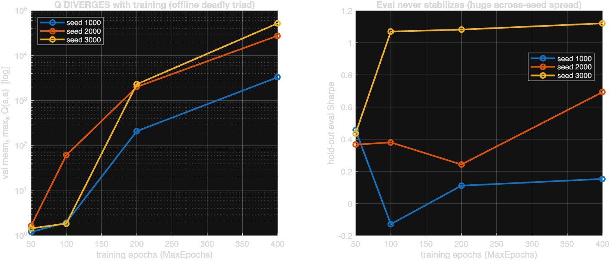
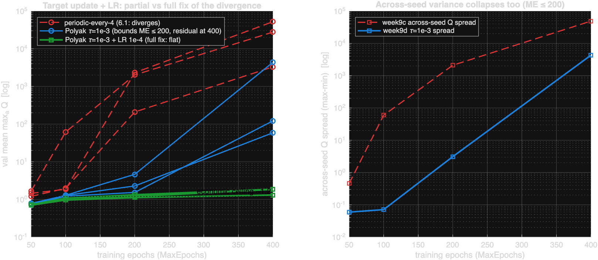
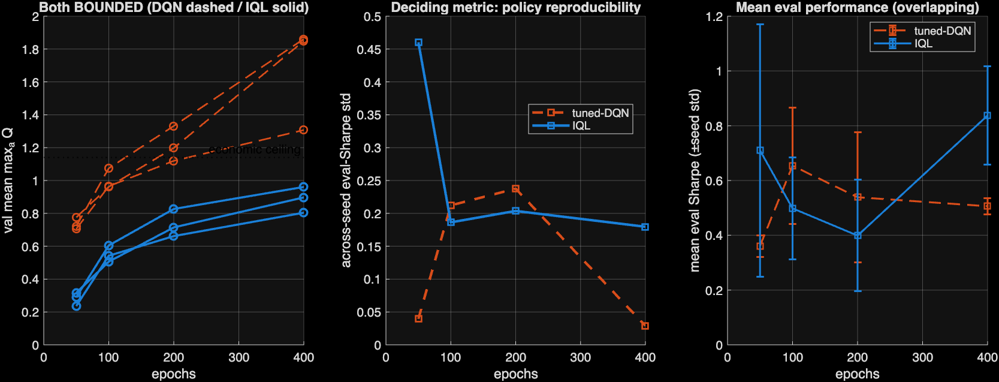

# Week 9–10 Report — Diagnosing 6.1's instability, and the deliverable agent

**Author:** Zhankai Zhang · **Mentor:** Yuchen Dong · **Branch:** `gbwm-pgoal-study`

> **Headline.** Instead of tuning 6.1 for better numbers, I diagnosed *why* it was
> unstable. 6.1's DQN Q-value never converged — it **diverges** with training. I
> traced it to **two misconfigured hyperparameters**, fixed it, and confirmed the fix
> with a structurally-different learner (IQL). **The contribution is the diagnosis; the
> agent is its artifact.**

---

## 1. The problem: 6.1's Q-value diverges (it never converged)

The across-seed Sharpe variance we've chased since Week 3 turned out to be a symptom.
Using a **confound-free convergence probe** (one fresh MATLAB process per (seed,
MaxEpochs) — avoids a `trainFromData` session-state trap; byte-reproducible), 6.1's
value estimate `mean(max_a Q)` **explodes with training** on all seeds:

| MaxEpochs | 100 | 200 | 400 |
|---|---|---|---|
| val mean maxQ (s1000/2000/3000) | 2.0 / 61 / 1.9 | 209 / 2018 / 2311 | 3307 / 27657 / 52298 |

This is the classic **offline "deadly triad"** (bootstrapping + function approximation +
off-policy data): the `max` over out-of-distribution actions in the Bellman target is
upward-biased on a fixed dataset, feeds back into the target, and Q chases itself. The
**blow-up epoch is seed-dependent**, so a fixed 100-epoch snapshot catches each seed at
a different point on its explosion curve → the across-seed variance.

*Figure 1 — 6.1's Q diverges with training (log scale, all seeds); eval is seed-dominated.*

---

## 2. Decomposition: two misconfigured hyperparameters (each step subagent-reviewed)

| Step | Finding | Evidence |
|---|---|---|
| 1 | **Target update too fast is the dominant driver.** 6.1 hard-copies the target net every 4 steps → it can't anchor the recursion. Polyak `τ=1e-3` bounds Q through ME≤200. | Fig 2, blue |
| 2 | **Reward scale is NOT the cause.** Shrinking the 158× terminal bonus 1.0→0.05 did *not* fix it (made it worse). | week9f |
| 3 | **The residual is a marginal recursion-gain instability, tunable by LR.** Lowering critic LR 5e-4→1e-4 bounds even the worst seed at ME=400 (4369 → 1.86). | Fig 2, green |

**Net:** the divergence is OOD-max-bootstrap in *mechanism* but *marginal* in severity —
the loop gain sits just above 1, and **two hyperparameters (target-update speed + learning
rate)** push it below 1. **A properly-configured vanilla DQN converges.** 6.1 was a
hyperparameter misconfiguration, not a hopeless setup.

*Figure 2 — Red: 6.1 (diverges). Blue: Polyak target alone (bounds ME≤200, residual at 400).
Green: Polyak + LR 1e-4 (full fix — flat along the economic ceiling to ME=400).*

---

## 3. Confirmation: IQL — a structurally-different learner reaches the same policy

I implemented **IQL** (custom `dlfeval` loop): it regresses an expectile of V(s) from
in-dataset actions and bootstraps Q from V(s') — the exploding `max_a Q(OOD)` term
**never appears**. On the final 25-cell matrix (tuned-DQN vs IQL × 3 seeds × 4 ME):

- **Both bounded** across all seeds/ME (tuned-DQN 0.71–1.86; IQL 0.24–0.96, always under
  the ~1.14 economic ceiling and flat). IQL also bounds at LR 1e-4 (no LR tuning needed).
- **Deciding metric — across-seed eval-Sharpe — is a NULL** (per-seed values below):

  | ME | tuned-DQN | IQL |
  |---|---|---|
  | 100 | 0.86 / 0.67 / 0.43 | 0.70 / 0.34 / 0.46 |
  | 200 | 0.72 / 0.62 / 0.27 | 0.62 / 0.34 / 0.23 |
  | 400 | 0.53 / 0.52 / 0.47 | 0.65 / 1.01 / 0.85 |

  Across-seed std 0.16 vs 0.19 — n=3 noise, crossing, no winner. Mean Sharpe ~0.4–0.7
  both, error bars overlap everywhere.

*Figure 3 — Both bounded; the deciding metric does not separate them; mean performance overlaps.*

**The equivalence is confirmatory, not a failure:** a structurally-different learner that
never queries the OOD max reaches the *same* policy → the fix is complete, and the
performance ceiling is the **data/regime, not the algorithm**.

---

## 4. Deliverable + honest boundaries

**Shipped agent = tuned-DQN (Polyak τ=1e-3, LR 1e-4, ME=100) = "fixed 6.1"** — honors
"continue 6.1", simpler/lower-risk than the custom IQL loop. IQL is the confirmatory
comparison (with two real secondary edges: no-LR-babysitting, better-calibrated values).

- `experiments/models/FinalAgent.mat` + `src/predictAction.m` — loads and runs in a
  clean session (verified via `scripts/check_final_agent.sh`).
- **Cost-aware backtest** (`src/week10_backtest.m`): shipped tuned-DQN (5 seeds) vs a
  daily 60/40 constant-mix, drift-aware turnover cost, block-bootstrap 95% Sharpe CI +
  Deflated Sharpe. CI/DSR are on the **shipped single agent (seed 1000)**, not pooled
  across seeds (pooling the same market path would fabricate independence). DSR trial
  count = 40 (the dozens of configs tried across week4–10; `1/T` is a lower bound on
  cross-trial dispersion, so the true DSR is if anything lower).

  **Full metric set @ 10 bp** (Sharpe annualized; MaxDD/Terminal across the 30 windows):

  | metric | tuned-DQN | 60/40 |
  |---|---|---|
  | Success rate (/30) | 13.4 | 12.0 |
  | Mean Sharpe | 0.42 | **0.49** |
  | Across-seed std | 0.23 | n/a (static) |
  | Mean MaxDD | 7.8% | **4.0%** |
  | MaxDD P90 | 16.2% | **8.7%** |
  | Worst Sharpe | −6.12 | **−5.56** |
  | Terminal P10 | 90,574 | **95,302** |
  | Mean Terminal | 100,422 | 100,273 |
  | 95% CI (Sharpe) | [−0.55, 1.49] | [−0.87, 1.30] |
  | Deflated Sharpe | 0.07 | 0.03 |

  **Net Sharpe vs cost:** DQN 0.54 / 0.48 / 0.42 / 0.29 at 0/5/10/20 bp; 60/40 0.51 /
  0.50 / 0.49 / 0.47. DQN's nominal edge at 0 bp evaporates by ~10 bp (higher turnover).

  **Honest read:** every Sharpe CI overlaps and includes 0 → tuned-DQN is **not
  statistically distinguishable from 60/40** net of cost, and 60/40 is in fact **better
  on tail risk** (half the MaxDD P90, higher Terminal P10) at lower turnover. Both DSRs
  sit far below any significance floor. This is the ~600-day single-regime power limit,
  not an algorithm failure — and it is exactly why **the contribution is the diagnosis,
  not a returns edge.** *(IQL row to be added once its cost-aware backtest completes.)*

**Honest null (stated up front):** net of cost, the agent is **not statistically
distinguishable from 60/40** — the ~600-day single-regime power limit, not an algorithm
failure. The DQN "converges" with one asterisk: Q is bounded but still mildly rising at
ME=400 (marginal instability suppressed, not eliminated) — which is precisely why IQL is
worth reporting.

---

## 5. Method note (relevant to a tooling audience)

Every finding passed **two subagent review gates** — code (before running) and results
(before acting). This caught real defects: a reproducibility confound, a false
"collapsed-policy" metric artifact, and a statistical bug (pooling seeds inflates the CI).
The convergence probe's **fresh-process-per-config** design gives byte-level
reproducibility. The whole result is effectively a characterization of the **RL Toolbox
offline-training defaults** (`TargetUpdateFrequency`, LR) under the deadly triad — directly
useful to MathWorks.
